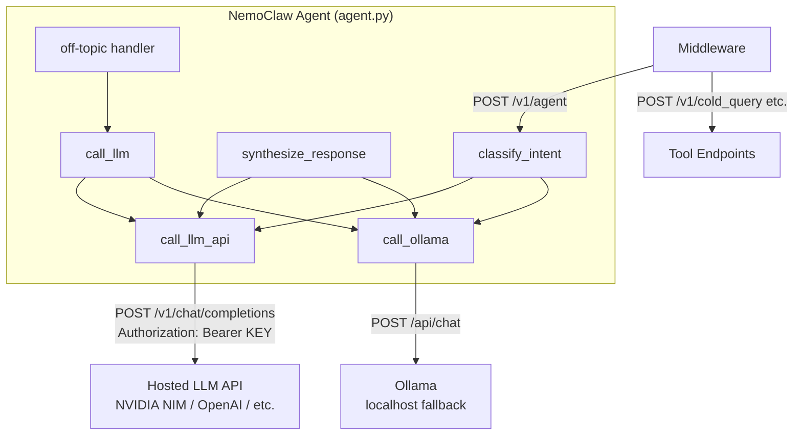

# Design Document: API LLM Backend

## Overview

This design reconfigures the NemoClaw agent to use a hosted/cloud LLM API instead of the local Nemotron NIM GPU inference server. The core change is replacing `call_nemotron()` with a new `call_llm_api()` function that sends OpenAI-compatible requests to a configurable hosted endpoint (e.g., NVIDIA NIM API, OpenAI, Together AI) with API key authentication. The Ollama fallback is preserved as a secondary provider. Docker Compose is updated to remove the GPU-dependent `nemotron-nim` service. All external-facing HTTP endpoints remain unchanged.

### Key Design Decisions

1. **Single unified client function** — `call_llm_api()` replaces both `call_nemotron()` and the primary path in `call_llm()`. This eliminates the split between two OpenAI-compatible clients that differed only in endpoint URL.
2. **Preserve Ollama as fallback, not primary** — The current code calls Ollama first in `classify_intent()`. The new design reverses this: hosted API is always primary, Ollama is always fallback. This simplifies the mental model.
3. **Preserve two-step synthesis** — `synthesize_response()` keeps its Nemotron-then-Ollama pattern, but "Nemotron" becomes the hosted API. Ollama still handles the summarization step when available.
4. **Environment-variable-driven configuration** — All provider settings (URL, model, key, timeout) come from environment variables with sensible defaults, so switching providers requires zero code changes.
5. **Startup validation** — The agent refuses to start if `LLM_API_KEY` is missing, preventing silent failures at request time.

## Architecture



### Call Flow

1. **classify_intent(text)** → `call_llm_api()` (primary) → `call_ollama()` (fallback if `USE_OLLAMA=true`)
2. **synthesize_response(tool_result, intent, text)** → Step 1: `call_llm_api()` for analysis → Step 2: `call_ollama()` for summarization (falls back to `call_llm_api()` if Ollama unavailable)
3. **call_llm(messages)** (used by off-topic handler) → `call_llm_api()` (primary) → `call_ollama()` (fallback)

## Components and Interfaces

### 1. `call_llm_api()` — New Unified LLM Client

Replaces `call_nemotron()`. Sends requests to the hosted API with Bearer token auth.

```python
def call_llm_api(
    messages: list,
    max_tokens: int = 150,
    temperature: float = 0.7
) -> Optional[str]:
    """
    Call hosted LLM API for inference.

    Args:
        messages: Chat messages in OpenAI format
            [{"role": "system"|"user"|"assistant", "content": str}]
        max_tokens: Maximum response tokens
        temperature: Sampling temperature

    Returns:
        Response text string on success, None on failure
    """
```

**Request construction:**
- URL: `{LLM_API_BASE_URL}/chat/completions`
- Headers: `{"Authorization": "Bearer {LLM_API_KEY}", "Content-Type": "application/json"}`
- Body: `{"model": LLM_MODEL_NAME, "messages": messages, "max_tokens": max_tokens, "temperature": temperature}`
- Timeout: `LLM_TIMEOUT_SECONDS` (default 30)

**Error handling:**
- HTTP 401/403 → log error with "authentication failure" message
- HTTP 429 → log warning with "rate limited" message
- Any failure → log status code + response body (truncated to 200 chars)
- All errors → return `None`

### 2. `call_ollama()` — Unchanged

Remains as-is. Used as fallback provider and for the summarization step in `synthesize_response()`.

### 3. `call_llm()` — Updated Fallback Chain

```python
def call_llm(messages, max_tokens=150, temperature=0.7) -> Optional[str]:
    # Try hosted API first (was: call_nemotron)
    result = call_llm_api(messages, max_tokens, temperature)
    if result:
        return result

    logger.warning("Hosted LLM API failed, falling back to Ollama...")

    if USE_OLLAMA:
        result = call_ollama(messages, max_tokens, temperature)
        if result:
            return result

    logger.error("All LLM providers failed")
    return None
```

### 4. `classify_intent()` — Updated Primary

Change from `call_ollama() or call_nemotron()` to `call_llm_api() or call_ollama()`:

```python
# Before:
response = call_ollama(messages, ...) or call_nemotron(messages, ...)

# After:
response = call_llm_api(messages, ...) or (call_ollama(messages, ...) if USE_OLLAMA else None)
```

### 5. `synthesize_response()` — Updated Analysis Step

Step 1 changes from `call_nemotron()` to `call_llm_api()`. Step 2 (Ollama summarization) stays the same. If Ollama is unavailable for step 2, fall back to `call_llm_api()`.

```python
# Step 1: Analysis (was call_nemotron)
nemotron_output = call_llm_api(nemotron_messages, max_tokens=600, temperature=0.3)

# Step 2: Summarization (Ollama preferred, hosted API fallback)
summary = call_ollama(ollama_messages, max_tokens=120, temperature=0.1)
if not summary or len(summary.strip()) <= 10:
    summary = call_llm_api(ollama_messages, max_tokens=120, temperature=0.1)
```

### 6. `validate_environment()` — Updated

Add `LLM_API_KEY` to required checks. Remove `NEMOTRON_NIM_HOST`/`NEMOTRON_NIM_PORT` from any implicit dependencies.

```python
def validate_environment() -> bool:
    required = ['POSTGRES_HOST', 'POSTGRES_USER', 'POSTGRES_PASSWORD', 'POSTGRES_DB']
    missing = [var for var in required if not os.environ.get(var)]

    api_key = os.environ.get('LLM_API_KEY', '').strip()
    if not api_key:
        logger.fatal("LLM_API_KEY environment variable is not set or empty")
        missing.append('LLM_API_KEY')

    if missing:
        logger.fatal(f"Missing required environment variables: {missing}")
        return False
    return True
```

### 7. Module-Level Configuration — Updated

```python
# Remove:
NEMOTRON_HOST = os.environ.get('NEMOTRON_NIM_HOST', 'nemotron-nim')
NEMOTRON_PORT = os.environ.get('NEMOTRON_NIM_PORT', '8000')
NEMOTRON_MODEL = os.environ.get('NEMOTRON_MODEL_NAME', 'nemotron-3-nano-30b-a3b')
NEMOTRON_ENDPOINT = f"http://{NEMOTRON_HOST}:{NEMOTRON_PORT}/v1/chat/completions"

# Add:
LLM_API_KEY = os.environ.get('LLM_API_KEY', '')
LLM_API_BASE_URL = os.environ.get('LLM_API_BASE_URL', 'https://integrate.api.nvidia.com/v1')
LLM_MODEL_NAME = os.environ.get('LLM_MODEL_NAME', 'nvidia/llama-3.1-nemotron-ultra-253b-v1')
LLM_TIMEOUT_SECONDS = int(os.environ.get('LLM_TIMEOUT_SECONDS', '30'))
LLM_ENDPOINT = f"{LLM_API_BASE_URL}/chat/completions"
```

## Data Models

No changes to data models. The `AgentRequest`, `AgentResponseModel`, and all tool result types (`ColdQueryResult`, `HotQueryResult`, `AgentResponse`, etc.) remain unchanged.

The only data-level change is in the HTTP request/response format between the agent and the LLM provider:

### LLM API Request (unchanged format, new auth header)

```json
{
  "model": "nvidia/llama-3.1-nemotron-ultra-253b-v1",
  "messages": [
    {"role": "system", "content": "..."},
    {"role": "user", "content": "..."}
  ],
  "max_tokens": 150,
  "temperature": 0.7
}
```

### LLM API Response (unchanged OpenAI format)

```json
{
  "choices": [
    {
      "message": {
        "role": "assistant",
        "content": "response text"
      }
    }
  ]
}
```

### Environment Variables Summary

| Variable | Default | Description |
|---|---|---|
| `LLM_API_KEY` | *(required)* | Bearer token for hosted API |
| `LLM_API_BASE_URL` | `https://integrate.api.nvidia.com/v1` | Base URL for hosted API |
| `LLM_MODEL_NAME` | `nvidia/llama-3.1-nemotron-ultra-253b-v1` | Model identifier |
| `LLM_TIMEOUT_SECONDS` | `30` | Request timeout in seconds |
| `USE_OLLAMA` | `true` | Enable Ollama fallback |
| `OLLAMA_HOST` | `host.docker.internal` | Ollama hostname |
| `OLLAMA_PORT` | `11434` | Ollama port |
| `OLLAMA_MODEL` | `llama3.2:3b` | Ollama model name |

**Removed variables:** `NEMOTRON_NIM_HOST`, `NEMOTRON_NIM_PORT`, `NEMOTRON_MODEL_NAME`

### Docker Compose Changes

**`docker-compose.yml`:**
- Remove `nemotron-nim` service definition (GPU-dependent NIM container)
- Remove `nim-model-cache` volume
- Update `nemoclaw` service:
  - Remove `depends_on: nemotron-nim`
  - Replace `NEMOTRON_NIM_HOST`, `NEMOTRON_NIM_PORT`, `NEMOTRON_MODEL_NAME` env vars with `LLM_API_KEY`, `LLM_API_BASE_URL`, `LLM_MODEL_NAME`, `LLM_TIMEOUT_SECONDS`
  - Add `USE_OLLAMA`, `OLLAMA_HOST`, `OLLAMA_PORT`, `OLLAMA_MODEL` env vars

**`docker-compose.override.yml`:**
- Remove `nemotron-nim` busybox stub service
- Update `nemoclaw` environment to use new `LLM_*` variables instead of `NEMOTRON_*`

**`docker-compose.dev.yml`:**
- Remove `nemotron-inference` service (local GPU inference server)
- Update `nemoclaw` environment to use new `LLM_*` variables

### `agent_config.yaml` Changes

```yaml
agent:
  name: pseudoMetaGlass-agent
  model: nvidia/llama-3.1-nemotron-ultra-253b-v1    # was: nemotron-3-nano-30b-a3b
  api_endpoint: https://integrate.api.nvidia.com/v1  # was: nim_endpoint: http://nemotron-nim:8000
  # ... tools, intents, sandbox unchanged
```

## Correctness Properties

*A property is a characteristic or behavior that should hold true across all valid executions of a system — essentially, a formal statement about what the system should do. Properties serve as the bridge between human-readable specifications and machine-verifiable correctness guarantees.*

### Property 1: Request body is well-formed OpenAI chat completion

*For any* valid messages list (non-empty list of dicts with "role" and "content" keys), any max_tokens positive integer, and any temperature float in [0, 2], the HTTP request body sent by `call_llm_api()` SHALL contain the keys "model", "messages", "max_tokens", and "temperature" with the provided values, and the "model" key SHALL equal the configured `LLM_MODEL_NAME`.

**Validates: Requirements 1.1, 1.4**

### Property 2: Authorization header is correctly formed

*For any* non-empty API key string, the HTTP request sent by `call_llm_api()` SHALL include an `Authorization` header with the value `"Bearer "` concatenated with the API key string, with no extra whitespace or modification.

**Validates: Requirements 1.2**

### Property 3: Endpoint URL is correctly constructed

*For any* base URL string set as `LLM_API_BASE_URL`, the HTTP request sent by `call_llm_api()` SHALL be directed to the URL formed by appending `/chat/completions` to that base URL string.

**Validates: Requirements 2.5**

### Property 4: Return type contract

*For any* valid OpenAI-format API response containing `choices[0].message.content` as a non-empty string, `call_llm_api()` SHALL return that string. *For any* HTTP error response (status code >= 400) or network error, `call_llm_api()` SHALL return `None`.

**Validates: Requirements 1.5**

### Property 5: Fallback to Ollama on primary HTTP error

*For any* HTTP error status code returned by the primary API provider, when `USE_OLLAMA` is `true`, the `call_llm()` function SHALL attempt the Ollama fallback. When `USE_OLLAMA` is `false`, the Ollama fallback SHALL NOT be attempted regardless of the error.

**Validates: Requirements 3.2, 3.5**

### Property 6: Timeout configuration is respected

*For any* positive integer value set as `LLM_TIMEOUT_SECONDS`, the HTTP request made by `call_llm_api()` SHALL use that value as the request timeout in seconds.

**Validates: Requirements 8.1**

### Property 7: Error logging includes status and truncated body

*For any* HTTP error response with a status code and a response body string, the log message emitted by `call_llm_api()` SHALL contain the numeric status code and the response body truncated to at most 200 characters.

**Validates: Requirements 8.5**

### Property 8: Confidence threshold determines clarification

*For any* float confidence value in [0, 1], the agent SHALL set `requires_clarification` to `true` if and only if the confidence is below the `NEMOCLAW_CONFIDENCE_THRESHOLD` (default 0.7).

**Validates: Requirements 9.3**

### Property 9: Think block stripping

*For any* string containing one or more `<think>...</think>` blocks (with arbitrary content between tags), the post-processing step SHALL produce a string that contains none of those blocks, while preserving all text outside the blocks.

**Validates: Requirements 9.4**

## Error Handling

### Startup Errors

| Condition | Behavior |
|---|---|
| `LLM_API_KEY` not set or empty | Log FATAL, `validate_environment()` returns `False`, agent exits |
| `POSTGRES_*` vars missing | Log FATAL, agent exits (existing behavior) |

### Runtime Errors

| Condition | Behavior |
|---|---|
| Primary API returns 401/403 | Log ERROR "Authentication failure for LLM API: {status}" → return `None` → trigger fallback |
| Primary API returns 429 | Log WARNING "Rate limited by LLM API" → return `None` → trigger fallback |
| Primary API returns other 4xx/5xx | Log ERROR with status code + body (truncated 200 chars) → return `None` → trigger fallback |
| Primary API times out | Log ERROR "LLM API request timed out after {timeout}s" → return `None` → trigger fallback |
| Primary API network error | Log ERROR with exception details → return `None` → trigger fallback |
| Ollama fallback fails | Log ERROR → `call_llm()` returns `None` → agent returns default response |
| Both providers fail in `classify_intent` | Return default `{"intent": "safety", "confidence": 0.5, ...}` (existing behavior) |
| Both providers fail in `synthesize_response` | Return raw context string (existing behavior) |
| JSON parse error in classification | Return `{"intent": "unclear", "confidence": 0.3, ...}` (existing behavior) |

### Graceful Degradation Chain

```
call_llm_api() → success → return response
    ↓ failure
log warning, try call_ollama() (if USE_OLLAMA=true)
    ↓ failure
log error, return None
    ↓
caller handles None with domain-specific default
```

## Testing Strategy

### Property-Based Tests (Hypothesis)

The project already uses `hypothesis` (in `requirements.txt`). Each correctness property maps to a property-based test with minimum 100 iterations.

| Property | Test Description | Generator Strategy |
|---|---|---|
| P1: Request body | Generate random messages, max_tokens, temperature; mock HTTP; verify request body | `st.lists(st.fixed_dictionaries({"role": st.sampled_from(["system","user","assistant"]), "content": st.text(min_size=1)}), min_size=1)`, `st.integers(min_value=1, max_value=4096)`, `st.floats(min_value=0, max_value=2)` |
| P2: Auth header | Generate random API key strings; mock HTTP; verify Authorization header | `st.text(min_size=1, max_size=200, alphabet=st.characters(whitelist_categories=('L','N','P')))` |
| P3: URL construction | Generate random base URLs; verify endpoint URL | `st.from_regex(r'https?://[a-z0-9.-]+(/[a-z0-9-]+)*', fullmatch=True)` |
| P4: Return type | Generate valid/error responses; verify return type | `st.one_of(st.just(200), st.sampled_from([400,401,403,404,429,500,502,503]))` |
| P5: Fallback behavior | Generate random error codes + USE_OLLAMA flag; verify fallback | `st.integers(min_value=400, max_value=599)`, `st.booleans()` |
| P6: Timeout config | Generate random timeout values; verify timeout passed | `st.integers(min_value=1, max_value=300)` |
| P7: Error logging | Generate random status codes + response bodies; verify log content | `st.integers(min_value=400, max_value=599)`, `st.text(min_size=0, max_size=500)` |
| P8: Confidence threshold | Generate random confidence floats; verify clarification flag | `st.floats(min_value=0.0, max_value=1.0)` (existing test) |
| P9: Think block stripping | Generate strings with embedded think blocks; verify removal | Custom strategy: `st.text()` interleaved with `<think>` + `st.text()` + `</think>` |

**Tag format:** `# Feature: api-llm-backend, Property {N}: {title}`

### Unit Tests (Example-Based)

- Startup validation: `LLM_API_KEY` missing → exit, empty → exit
- Default values: `LLM_API_BASE_URL` defaults to NVIDIA, `LLM_MODEL_NAME` defaults correctly, `LLM_TIMEOUT_SECONDS` defaults to 30
- Specific error codes: 401 → auth error log, 403 → auth error log, 429 → rate limit warning
- Fallback chain: primary fails + `USE_OLLAMA=false` → no Ollama call, both fail → `None`
- `classify_intent` calls `call_llm_api` first (not `call_ollama`)
- `synthesize_response` uses `call_llm_api` for analysis, `call_ollama` for summarization

### Existing Test Compatibility

The existing `test_agent.py` mocks `agent.call_nemotron`. After refactoring:
- `call_nemotron` is removed and replaced by `call_llm_api`
- Test mocks change from `@patch('agent.call_nemotron')` to `@patch('agent.call_llm_api')`
- The existing property-based test for confidence threshold (`test_confidence_threshold_property`) requires no changes — it tests the threshold logic directly, not the LLM client
- All test assertions remain the same since the function signatures and return types are compatible

### Integration / Smoke Tests

- Docker Compose: `docker compose config` validates the updated YAML
- `.env.example`: verify new variables present, old Nemotron variables removed
- `agent_config.yaml`: verify updated model and endpoint fields
- Endpoint smoke test: `POST /v1/agent` with mocked LLM returns valid `AgentResponseModel`
